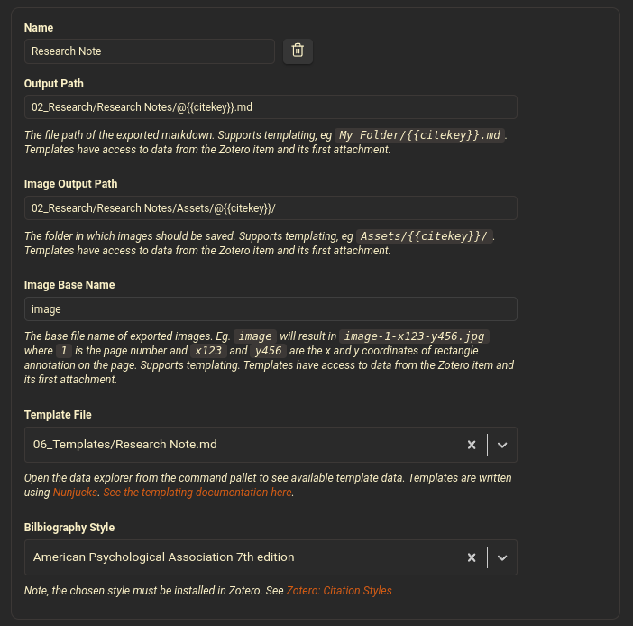

# Zotero-Integration-Config
Collection of configuration materials for Obsidian Zotero Integration Plugin.

## Installation

1. Install Zotero Integration plugin for Obsidian and follow configuration instructions.

  1. Configure Zotero Integration import profile to use the `Research Note.md` template file. Something like: 

2. Place `zotero-integration-config.css` in `\<vault\>/.obsidian/snippets`.

3. In the Obsidian settings menu under Appearance, enable the toggle for the `zotero-integration-config.css` snippet. This will enable color-based highlighting for callouts created when annotations are imported from Zotero.

4. Finally, test.

> [!NOTE]
> Helpful resources for configuration and callout documentation:
> 1. [Callouts](https://help.obsidian.md/Editing+and+formatting/Callouts)
> 2. [CSS Snippets](https://help.obsidian.md/Extending+Obsidian/CSS+snippets)
> 3. [Obsidian Colors](https://docs.obsidian.md/Reference/CSS+variables/Foundations/Colors) - _use rgb values_
> 4. [This thread](https://forum.obsidian.md/t/custom-callout-attributes/92473) for conditions for CSS override and using variables.
